# Blockuiz

原计划 project 由于某些原因未能完成，后改为实现答题游戏。

## 所有源码Github地址

[Blockquiz](https://github.com/170226/blockuiz)

## 选题背景、依据

- 选题背景源于区块链技术相关知识分享平台，旨在让更多的人学习了解一些关于区块链的基础知识，从而使其能够更快地普及发展，并应用到更多的领域之中。

- 选题依据：通过区块链技术去中心化实现用户创建-回答问题模式。

## 使用说明

运行环境：windows

- 从 [Github](https://github.com/170226/blockuiz) 下载代码到本地。

- 使用 [Remix IDE](https://remix.ethereum.org) 编译并运行合约代码。  

    准备工作：  

    - Git、 nodejs

    - Metamask

    - 安装并运行 Ganache，搭建一条包含十个账户的私链。

        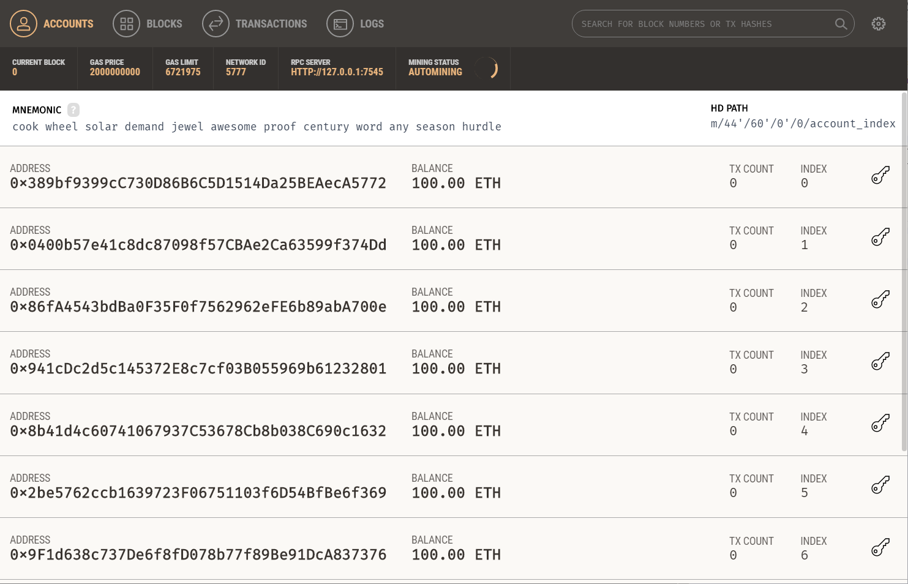

    1. 将 contracts 目录下的合约文件拷贝到 Remix 网页编辑器中。  

        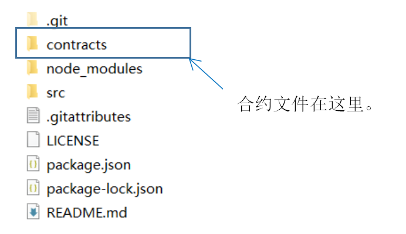

    2. 选择编译器版本为 0.4.24 编译代码。  

        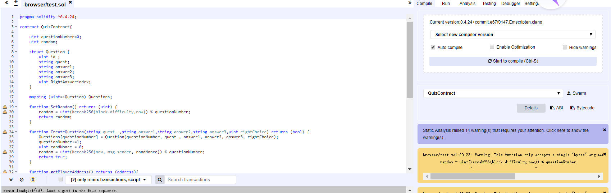

    3. 点击进入 run 选项卡， Environment 项选择 Web3 Provider，将localhost 改为 7545 （与私链相同）。

        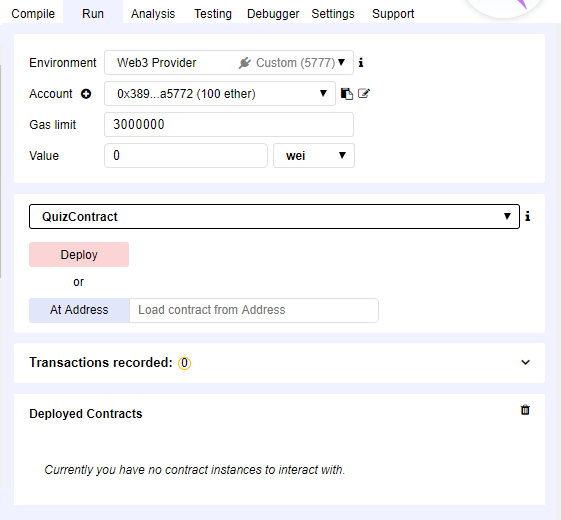

        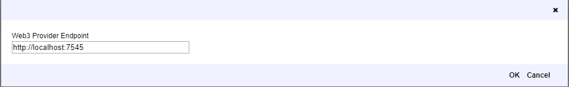

    4. 点击 Deploy 部署。拷贝合约地址，粘贴到 src 目录下 index.js 新建合约实例的代码中并保存修改。

        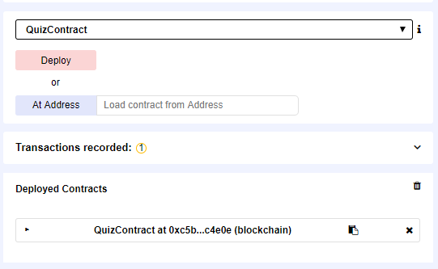

        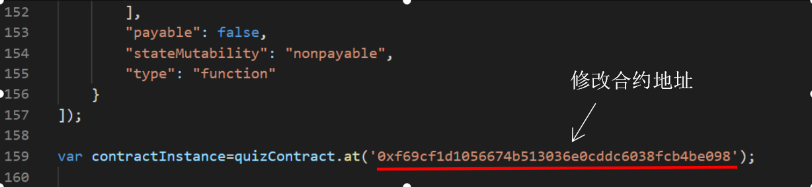

    5. 打开 Git，在项目目录下执行如下命令：

        > npm install --save-dev lite-server

        > npm run dev

    6. 最后在 Firefox 或者 Chrome 中打开网页，按[教程](http://bubuko.com/infodetail-2744450.html)配置好 MetaMask便可以使用了。

## 测试

- 初始界面

    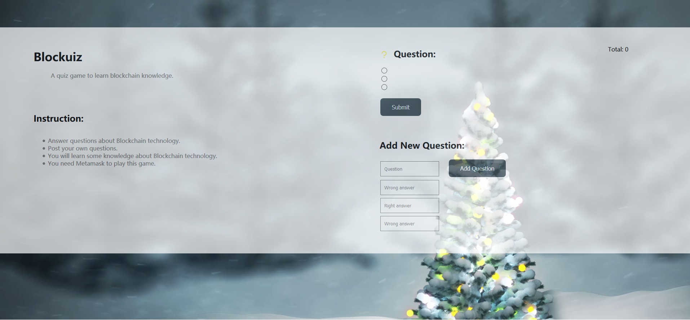

- 添加问题

    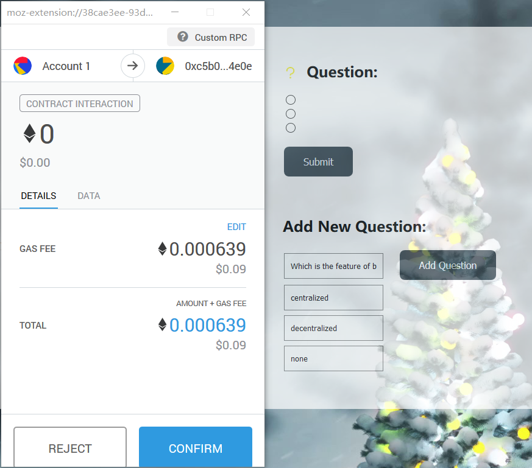

- 回答正确

    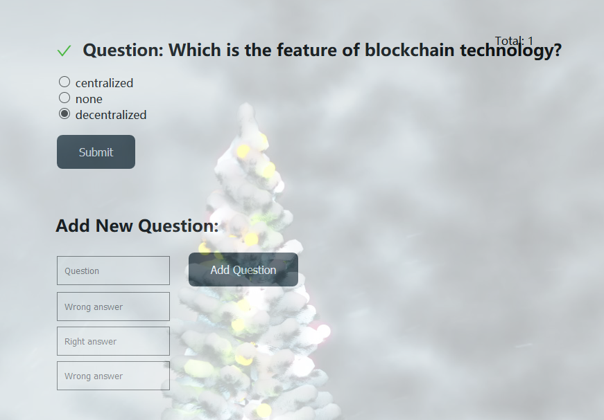

- 回答错误

    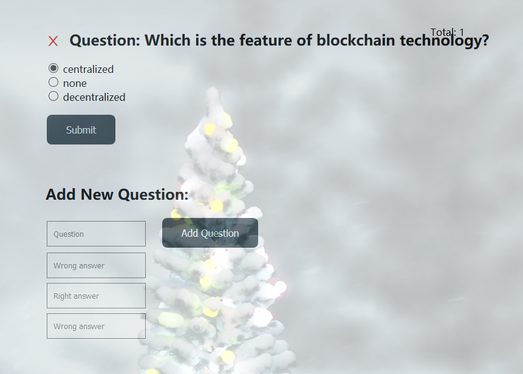

- 总问题数可以从右上角 Total 看到

    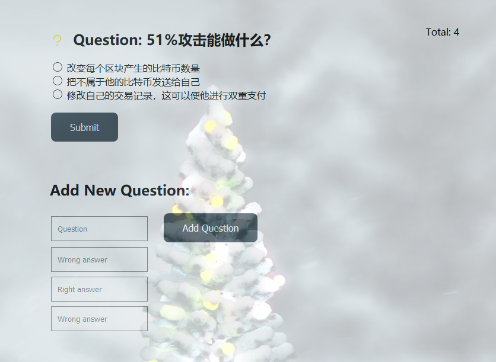

## 存在问题

- 回答正确跳到下一题的功能没有实现

- 界面布局还存在一些问题如：添加问题表单输入栏太短，字体太小。

## 更多功能敬请期待

- 用户分数、等级的设置

- 添加问题的时候可以给出知识点链接

- 用户回答时如果觉得问题存在争议，可以发送反馈提出问题。如果总反馈数到达一定比例，则问题被更改或被取消。

## 感想

由于时间、能力均有限，当前只能完成这些功能。利用一周多的时间实现还是挺紧张也挺艰辛的。至于后续功能，以后如果有时间还是会补充的，现在要去复习期末了。